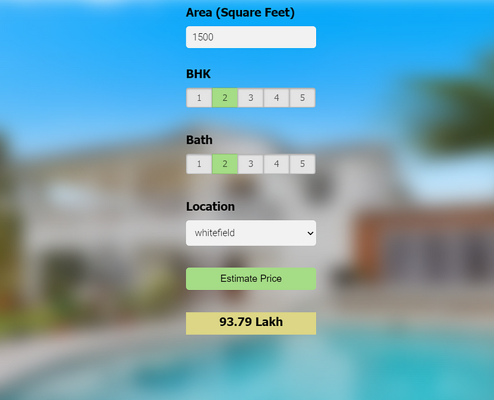

#### Flask API for Bengaluru Real Estate Price Prediction
   
**Description:**
This Flask application serves as the backend for a real estate price prediction system designed for properties in Bengaluru. It features a REST API to fetch available locations and predict home prices based on user inputs.

**Features:**
1. **Location Fetching:** Provides a list of all available locations in Bengaluru that can be queried by potential homebuyers.
2. **Price Prediction:** Allows users to estimate the price of a home based on its square footage, location, number of bedrooms, and bathrooms.

**Endpoints:**
- `GET /get_location_names` - Returns a list of real estate locations.
- `POST /predict_home_price` - Returns the predicted price based on the provided parameters: `total_sqft`, `location`, `bhk`, and `bath`.

**Setup and Run:**
- Ensure Python and Flask are installed.
- Run `app.py` to start the server.
- The system automatically loads the pre-trained model and location details upon startup.

**Util Module:**
This module (`util.py`) is responsible for:
- Loading and parsing model artifacts.
- Providing utility functions to predict prices and fetch location details.

### Resume Content:
---

**Real Estate Price Prediction System | Python, Flask, JavaScript, HTML, CSS**
- Developed a Flask-based REST API for predicting real estate prices in Bengaluru with a Python backend, facilitating interaction through GET and POST methods.
- Implemented functionality to dynamically fetch location data and predict property prices using a machine learning model loaded from serialized artifacts.
- Achieved efficient model integration and data handling using Python libraries like NumPy, Flask, and JSON for parsing and computations.
- Deployed the application on a local server, enabling real-time data processing and responsive interactions for end-users.
